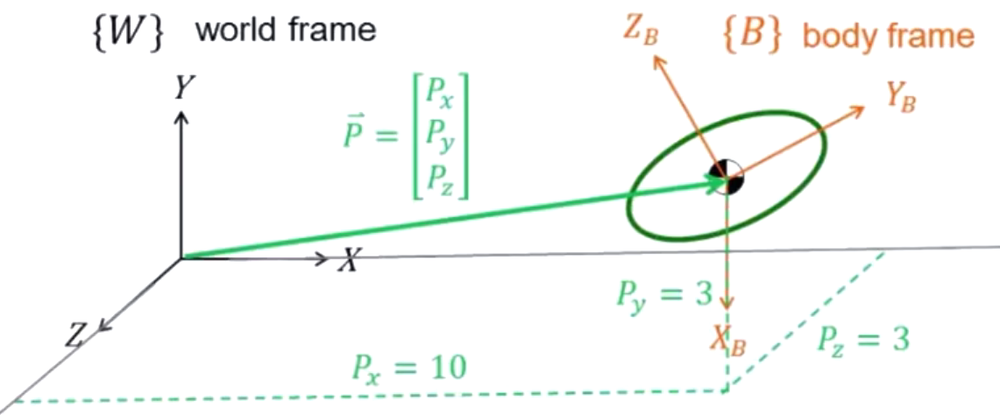
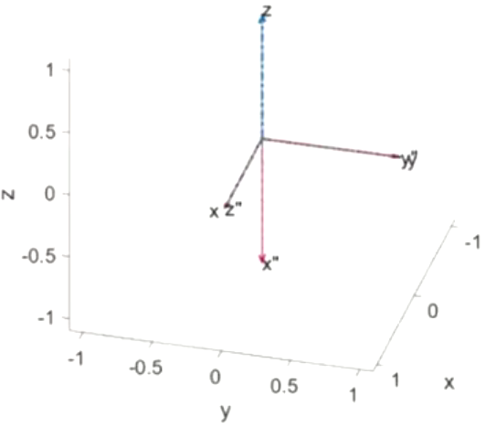
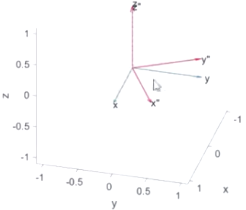
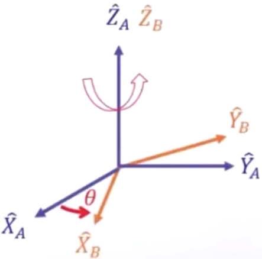

# 0. 学习资源

图见[仓库](https://github.com/RS-HIT/RS-HIT.github.io.git "RS的学习笔记")

## 0.1 视频链接

[B站课程](https://www.bilibili.com/video/BV1oa4y1v7TY/?spm_id_from=333.337.search-card.all.click&vd_source=7aa431eece1d1c0d38afe62a0e6d152f)
[B站课程](https://www.bilibili.com/video/BV1v4411H7ez?spm_id_from=333.788.videopod.episodes&vd_source=7aa431eece1d1c0d38afe62a0e6d152f&p=5)

# 1. 刚体运动的描述

## 1.1 描述一个刚体的状态

- 平面
  在平面上需要**3**个参数描述其**2**个移动自由度和**1**个转动自由度
- 空间
  在空间中需要**6**个参数描述其**3**个移动自由度和**3**个转动自由度

## 1.2 整合表达刚体的状态

在刚体的质心处建立坐标系, 以量化描述刚体的移动和转动. 通过微分求解速度与加速度

## 1.3 移动的描述

以向量(vector) $\vec{P}$ 来描述 $\{B\}$ 的原点相对于 $\{A\}$ 的状态

$$
\vec{P}=
\left[
    \begin{matrix}
    P_x \\
    P_y \\
    P_z
\end{matrix}
\right]=
^{A}P_{Borg}=origin{\quad}of{\quad}\{B\}{\quad}represented{\quad}in{\quad}\{A\}
$$

## 1.4 转动的描述

旋转矩阵来描述 $\{B\}$ 的原点相对于 $\{A\}$ 的姿态
投影, 内积

$$
{}_{B}^{A}R= \left[ \begin{matrix}|&|&|\\ {}^{A} \hat{X}_{B}&{}^{A} \hat{Y}_{B}&{}^{A} \hat{Z}_{B} \\ |&|&|\end{matrix} \right]=
\left[ \begin{matrix} \hat{X}_{B} \cdot \hat{X}_{A}& \hat{Y}_{B} \cdot \hat{X}_{A}& \hat{Z}_{B} \cdot \hat{X}_{A} \\ \hat{X}_{B} \cdot \hat{Y}_{A}& \hat{Y}_{B} \cdot \hat{Y}_{A}& \hat{Z}_{B} \cdot \hat{Y}_{A} \\ \hat{X}_{B} \cdot \hat{Z}_{A}& \hat{Y}_{B} \cdot \hat{Z}_{A}& \hat{Z}_{B} \cdot \hat{Z}_{A} \end{matrix} \right]
$$

**例 1:**

图中蓝色虚线为 $\{A\}$ 坐标系, 红色实线为 $\{B\}$坐标系, 则:

$\{B\}$ 的 $x''$ 轴为 $\{A\}$ 的 $z$轴 反向 $\Rightarrow{}^{A} \hat{X}_{B}= \left[ \begin{matrix} 0 \\ 0 \\ -1 \end{matrix} \right]$

$\{B\}$ 的 $y''$ 轴为 $\{A\}$ 的 $y$轴 重叠 $\Rightarrow{}^{A} \hat{Y}_{B}= \left[ \begin{matrix} 0 \\ 1 \\ 0 \end{matrix} \right]$

$\{B\}$ 的 $z''$ 轴为 $\{A\}$ 的 $x$轴 重叠 $\Rightarrow{}^{A} \hat{Z}_{B}= \left[ \begin{matrix} 1 \\ 0 \\ 0 \end{matrix} \right]$

因此, $\{B\}$ 的原点相对于 $\{A\}$ 的姿态:

$$
{}_{B}^{A}R= \left[ \begin{matrix}|&|&|\\ {}^{A} \hat{X}_{B}&{}^{A} \hat{Y}_{B}&{}^{A} \hat{Z}_{B} \\ |&|&|\end{matrix} \right]=
\left[
    \begin{matrix}
    0 & 0 & 1 \\
    0 & 1 & 0 \\
    -1 & 0 & 0
\end{matrix}
\right]
$$

**例 2:**
红色往蓝色上投影!

图中蓝色虚线为 $\{A\}$ 坐标系, 红色实线为 $\{B\}$坐标系, 则:

$$
{}^{A}\hat{X}_{B}=
\left[\begin{matrix}
\hat{X}_{B} \cdot \hat{X}_{A} \\
\hat{X}_{B} \cdot \hat{Y}_{A} \\
\hat{X}_{B} \cdot \hat{Z}_{A}
\end{matrix}\right]=
\left[\begin{matrix}
{\frac {\sqrt 3}{2}} \\[1.0ex]
{\frac{1}{2}} \\[1.0ex]
0
\end{matrix} \right]
$$

$$
{}^{A}\hat{Y}_{B}=
\left[\begin{matrix}
\hat{Y}_{B} \cdot \hat{X}_{A} \\
\hat{Y}_{B} \cdot \hat{Y}_{A} \\
\hat{Y}_{B} \cdot \hat{Z}_{A} \end{matrix} \right]=
\left[\begin{matrix}
{-\frac{1}{2}} \\[1.0ex]
{\frac {\sqrt 3}{2}} \\[1.0ex]
0
\end{matrix} \right]
$$

$$
{}^{A}\hat{Z}_{B}= \left[ \begin{matrix} \hat{Z}_{B} \cdot \hat{X}_{A} \\ \hat{Z}_{B} \cdot \hat{Y}_{A} \\ \hat{Z}_{B} \cdot \hat{Z}_{A} \end{matrix} \right]= \left[ \begin{matrix} 0 \\ 0 \\ 1 \end{matrix} \right]
$$

则 $\{B\}$ 相对于 $\{A\}$ 的姿态:

$$
{}^{A}_{B}R=
\left[\begin{matrix}
{\frac {\sqrt 3}{2}} & -{\frac{1}{2}} & 0 \\[1.0ex]
{\frac{1}{2}} & {\frac {\sqrt 3}{2}} & 0 \\[1.0ex]
0 & 0 & 1
\end{matrix}\right]
$$

## 1.5 旋转矩阵的特性

### 1.5.1 特性 1

由于内积无顺序性, 将向量互换, 则可得到

$$
{}_{B}^{A}R= \begin{bmatrix}\hat{X}_{B}\cdot\hat{X}_{A}&\hat{Y}_{B} \cdot\hat{X}_{A}&\hat{Z}_{B}\cdot\hat{X}_{A}\\ \hat{X}_{B}\cdot\hat{Y}_{A}&\hat{Y}_{B}\cdot\hat{Y}_{A}& \hat{Z}_{B}\cdot\hat{Y}_{A}\\ \hat{X}_{B}\cdot\hat{Z}_{A}&\hat{Y}_{B}\cdot\hat{Z}_{A}& \hat{Z}_{B}\cdot\hat{Z}_{A}\end{bmatrix}= \begin{bmatrix}|&|&|\\ {}^{A}\hat{X}_{B}&{}^{A}\hat{Y}_{B}&{}^{A}\hat{Z}_{B}\\ |&|&|\end{bmatrix}
$$

$$
=\begin{bmatrix}\hat{X}_{A}\cdot\hat{X}_{B}& \hat{X}_{A}\cdot\hat{Y}_{B}&\hat{X}_{A}\cdot\hat{Z}_{B}\\ \hat{Y}_{A}\cdot\hat{X}_{B}&\hat{Y}_{A}\cdot\hat{Y}_{B}& \hat{Y}_{A}\cdot\hat{Z}_{B}\\ \hat{Z}_{A}\cdot\hat{X}_{B}&\hat{Z}_{A}\cdot\hat{Y}_{B}& \hat{Z}_{A}\cdot\hat{Z}_{B}\end{bmatrix}=\begin{bmatrix}-&{}^{B} \hat{X}_{A}{}^{T}&-\\ -&{}^{B}\hat{Y}_{A}{}^{T}&-\\ -&{}^{B}\hat{Z}_{A}{}^{T}&-\end{bmatrix}
$$

$$
= \begin{bmatrix}|&|&|\\ {}^{B}\hat{X}_{A}&{}^{B}\hat{Y}_{A}&{}^{B}\hat{Z}_{A}\\ |&|&|\end{bmatrix}^{T}={}_{A}^{B}R^{T}
$$

即 $\{B\}$ 相对于 $\{A\}$ 的姿态矩阵等于 $\{A\}$ 相对于 $\{B\}$ 的姿态矩阵的转置

### 1.5.2 特性 2

$$
{}^{A}_{B}R^{T} {}^{A}_{B}R=\begin{bmatrix}|&|&|\\ {}^{A}\hat{X}_{B}&{}^{A}\hat{Y}_{B}&{}^{A}\hat{Z}_{B}\\ |&|&|\end{bmatrix}^{T}\begin{bmatrix}|&|&|\\ {}^{A}\hat{X}_{B}&{}^{A}\hat{Y}_{B}&{}^{A}\hat{Z}_{B}\\ |&|&|\end{bmatrix}
$$

$$
= \left[ \begin{matrix}-&{}^{A} \hat{X}_{B}{}^{T}&- \\ -&{}^{A} \hat{Y}_{B}{}^{T}&- \\ -&{}^{A} \hat{Z}_{B}{}^{T}&- \end{matrix} \right] \left[ \begin{matrix}|&|&|\\ {}^{A} \hat{X}_{B}&{}^{A} \hat{Y}_{B}&{}^{A} \hat{Z}_{B} \\ |&|&|\end{matrix} \right]
=\left[\begin{matrix}1&0&0 \\ 0&1&0 \\ 0&0&1\end{matrix}\right]
$$

$$
\Rightarrow {}^{A}_{B}R^{T} {}^{A}_{B}R=I_3={}^{A}_{B}R^{-1} {}^{A}_{B}R
$$

$$
\Rightarrow {}^{A}_{B}R^{T}={}^{A}_{B}R^{-1}={}^{B}_{A}R
$$

即位姿矩阵的转置等于其逆矩阵, 即该矩阵为正交矩阵.

### 1.5.3 特性 3

正交矩阵每一列都是长度为 1 的单位向量且彼此垂直, 故虽然 3\*3 的矩阵有 9 个元素, 但正交性条件带来了三个约束, 故剩下 3 个自由度刚好对应了三维空间中的旋转.

## 1.6 关于旋转矩阵的表达与作用

假设 $\{B\}$ 相对于 $\{A\}$ 绕 $\hat{Z}_{A}$ 轴沿正方向旋转 $\theta$ 角度
旋转方向右手定则为正

$$
R_{ \hat{Z}_{A}} \left( \theta \right)= \left[ \begin{matrix} \cos \theta & -\sin \theta&0 \\ \sin \theta& \cos \theta&0 \\ 0&0&1 \end{matrix} \right]
$$

一般简写为

$$
R_{ \hat{Z}_{A}} \left( \theta \right)= \left[ \begin{matrix} c \theta & -s \theta & 0 \\ s \theta& c \theta & 0 \\ 0&0&1 \end{matrix} \right]
$$

同理可得绕$\hat{X}_{A}$轴旋转:

$$
R_{ \hat{X}_{A}} \left( \theta \right)=
\left[ \begin{matrix} 1&0&0 \\ 0&c \theta&-s \theta \\ 0&s \theta&c \theta \end{matrix} \right]
$$

绕$\hat{Y}_{A}$轴旋转:

$$
R_{ \hat{Y}_{A}} \left( \theta \right)=
\left[ \begin{matrix} c \theta&0&s \theta \\ 0&1&0 \\ -s \theta&0&c \theta \end{matrix} \right]
$$

例:
${}^{A}P=\left[ \begin{matrix} 0 \\ 1 \\ \frac{\sqrt{3}}{2} \end{matrix} \right]$ 对 $\hat{X}_{A}$ 轴旋转30°, 则 ${}^{A}P'=?$
解:
$$
R_{ \hat{X}_{A}} \left( \theta \right)=
\left[ \begin{matrix} 1&0&0 \\ 0&c \theta&-s \theta \\ 0&s \theta&c \theta \end{matrix} \right]
$$
$$
{}^{A}P'=R_{\hat{X}_{A}}(\theta) {}^{A}P
=\left[\begin{matrix} 0\\0\\2 \end{matrix} \right]
$$

### 1.7 总结: 旋转矩阵的三种用法

- 描述一个坐标轴相对于另一个坐标轴的姿态

$$
{}_{B}^{A}R= \left[ \begin{matrix}|&|&|\\ {}^{A} \hat{X}_{B}&{}^{A} \hat{Y}_{B}&{}^{A} \hat{Z}_{B} \\ |&|&|\end{matrix} \right]
$$

- 将向量由某一个坐标轴的表达换到另一个和此坐标轴仅有相对转动的坐标轴来表达

$$
{}^{A}P={}^{A}_{B}R{}^{B}P
$$

- 将向量在同一个坐标系中进行转动

$$
{}^{A}P'=R(\theta)^{A}P
$$

