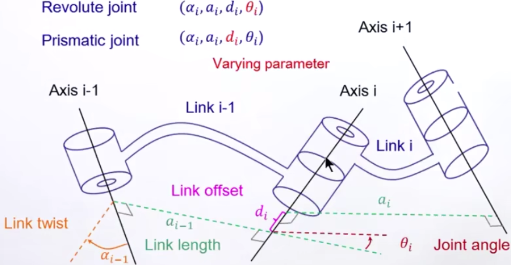
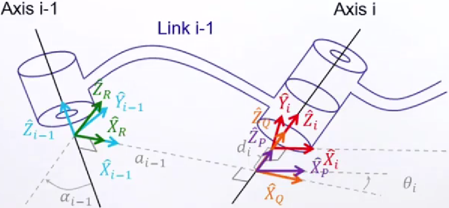

# 3 机械臂顺向运动学

## 3.1. 机械臂

- 机械臂
  - 多个杆件相串联, 具有复杂的几何外形
  - 杆件间可相对移动或转动, 由致动器驱动来达成
- 对应关系
  - 需求: 手臂末端点状态(位置 ${}^{W}P$ , 速度...)
  - 达成方式: 驱动各致动器
    ${}^{P} = f(\theta_1, \theta_2, \ldots, \theta_n)$
- 描述手臂状态方法
  - 找出杆件间的相对几何状态
  - 在各杆件上建立坐标系(frame), 以坐标系状态来代表杆件状态

### 3.2  手臂几何描述方式

- 关节(Joint)
  - 每个转动(revolute)或平移(prismatic)的关节具有1自由度(DOF)
  - 每个关节对某特定轴(axis)进行转动(rotation)或移动(translation)
- 杆件(Link)
  - 连接关节的杆件, 为刚体
  - 编号方式
    - Link 0: 地杆, 不动的杆件
    - Link 1: 和Link 0相连, 第一个可动的杆件
    - Link 2: 第二个可动的杆件
    - 依序下去...
- 对空间中2个任意方向的轴(axes), 2轴之间具有一线段和此2轴都互相垂直
  每2杆之间, 用 $a$ 和 $\alpha$ 即可清楚定义
- 但若要多杆串联, 则另需要2个参数 $(d_i, \theta_i)$ , 来描述相邻线段 $a_{i-1}$ 和 $a_i$ 间的相对几何关系
  旋转关节(Revolute joint) $(\alpha_i, a_i, d_i, \textcolor{yellow}{\theta_i})$
  平移关节(Prismatic joint) $(\alpha_i, a_i, \textcolor{yellow}{d_i}, \theta_i)$
  

## 3.3 DH表示法(Craig version / standard)

### 3.3.1 定义

- $\hat{Z_i}$ 转动或移动轴(axis)的方向
- $\hat{X_i}$ 沿着 $a_i$ 方向(if $a_i \neq 0$), 和 $\hat{Z_i}$ , $\hat{Z}_{i+1}$ 两者垂直(if $a_i = 0$ )
- $\hat{Yi}$ 与 $\hat{X_i}$ 和 $\hat{Z_i}$ 两者垂直, 依循右手定则
- 地杆link(0)
  $a_0 = 0 \ \alpha_0 = 0$
  与第一个关节的初始位置取相同坐标轴方向, 即
  旋转关节-- $\theta_1$ 任意(通常选择0), $d_1 = 0$
  平移关节-- $d_1$ 任意(通常选择0), $\theta_1 = 0$
- 末端杆(Last link(n))
  取和 $\hat{X}_{n-1}$ 同方向, $a_n = 0 \ \alpha_n = 0$

- DH表达法
  右手定则?
  "以某方向看"是指由负方向看向正方向, 逆时针为正

  |符号|含义|
  |:--:|:--:|
  | $\alpha_{i-1}$ | 以 $\hat{X}_{i-1}$ 方向看, $\hat{Z}_{i-1}$ 和 $\hat{Z_i}$ 间的夹角 |
  | $a_{i-1}$ | 沿着$\hat{X}_{i-1}$ 方向看, $\hat{Z}_{i-1}$ 和 $\hat{Z_i}$ 间的距离 |
  | $\theta_i$ | 以 $\hat{Z_i}$ 方向看 $\hat{X}_{i-1}$ 和 $\hat{X_i}$ 间的夹角 |
  | $d_i$ | 沿着 $\hat{Z_i}$ 方向看, $\hat{X}_{i-1}$ 和 $\hat{X_i}$ 间的距离 |

### 3.3.2 连杆转换矩阵

$$
{}^{i-1}P = {}^{i-1}_{\quad i}T^iP = {}^{i-1}_{\ \ \ R}T^R_QT^Q_PT^P_iT^iP
$$

$$
{}^{i-1}_{\quad i}T = \textcolor{green}{^{i-1}_{\ \ \ R}T} \textcolor{orange}{^R_QT} \textcolor{purple}{^Q_PT} \textcolor{red}{^P_iT}
$$

$$ =
\textcolor{green}{T_{\hat{X}_{i-1}}(\alpha_{i-1})} \textcolor{orange}{T_{\hat{X}_{R}}(a_{i-1})} \textcolor{purple}{T_{\hat{Z}_{Q}}(\theta_i)} \textcolor{red}{T_{\hat{Z}_{P}(d_i)}}
$$

$$ =
\begin{bmatrix}
c \theta_{i}&-s \theta_{i}&0&a_{i-1} \\
s \theta_{i}c \alpha_{i-1}&c \theta_{i}c \alpha_{i-1}&-s \alpha_{i-1}&-s \alpha_{i-1}d_{i} \\
s \theta_{i}s \alpha_{i-1}&c \theta_{i}s \alpha_{i-1}&c \alpha_{i-1}&c \alpha_{i-1}d_{i} \\
0&0&0&1
\end{bmatrix}
$$

- 连续连杆转换
  ${}^{0}_{n}T = {}^{0}_{1}T{}^{1}_{2}T{}^{2}_{3}T \dots {}^{n-2}_{n-1}T {}^{n-1}_{\quad n}T$
  坐标系n(Frame {n})相对于坐标系0的空间几何关系具清楚且量化之定义, 在Frame {n}下表达的向量可转回Frame {0}下来表达.

例题: [林沛群课程](https://www.bilibili.com/video/BV1v4411H7ez?spm_id_from=333.788.player.switch&vd_source=7aa431eece1d1c0d38afe62a0e6d152f&p=21)
